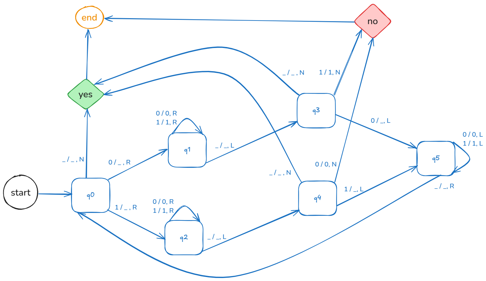
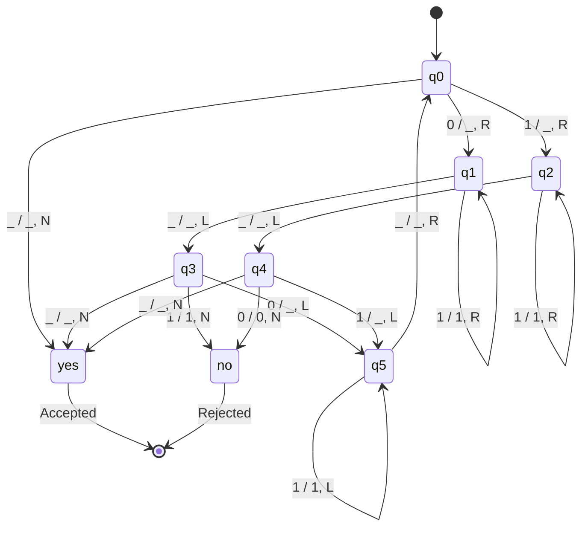

# turing-machine-in-sql

Implemented turing machine simulation in SQL to prove that "SQL is indeed a programming language"





### Getting started

```shell
  $ git clone https://github.com/mrwormhole/turing-machine-in-sql
  $ docker compose up -d --build
  $ docker exec -it postgres-turing psql -U turing -d turing_machine
  turing_machine=# select * FROM machine_steps;
  turing_machine=# call run_palindrome_program('1001');
  turing_machine=# select * FROM machine_steps;
```

The original blog post can be found [here](https://wormholerelays.com/posts/sql-turing-completeness)
